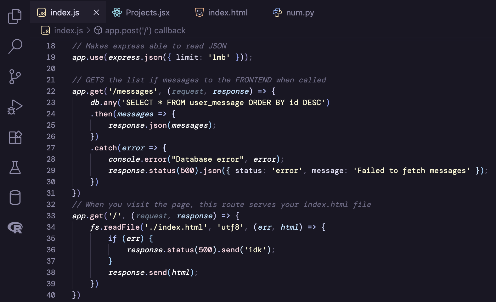

# Phantom Theme 🎐

A cold and pastel dark theme for VS Code. Inspired by Rosé Pine and Luigi's Mansion.

## Screenshot

## Usage

1. Open VSCode
2. Search for **Phantom Theme** (by Myna Vu) in extensions
3. Install the theme and choose your variant in `Preferences: Color Theme`

**Have fun coding!**

